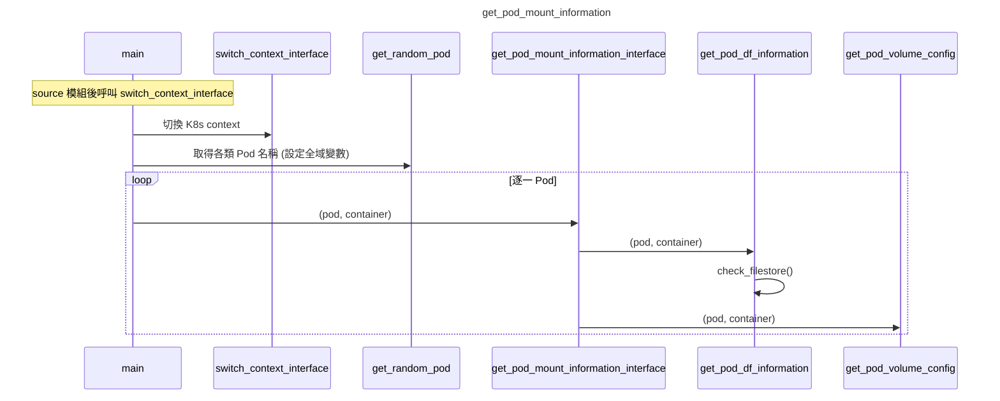

# get_pod_mount_information

```mermaid
---
title: get_pod_mount_information
---
sequenceDiagram
  participant M as main
  participant SC as switch_context_interface
  participant GR as get_random_pod
  participant IF as get_pod_mount_information_interface
  participant DF as get_pod_df_information
  participant VC as get_pod_volume_config
  note over M: source 模組後呼叫 switch_context_interface
  M->>SC: 切換 K8s context
  M->>GR: 取得各類 Pod 名稱 (設定全域變數)
  loop 逐一 Pod
    M->>IF: (pod, container)
    IF->>DF: (pod, container)
    DF->>DF: check_filestore()
    IF->>VC: (pod, container)
  end
```
